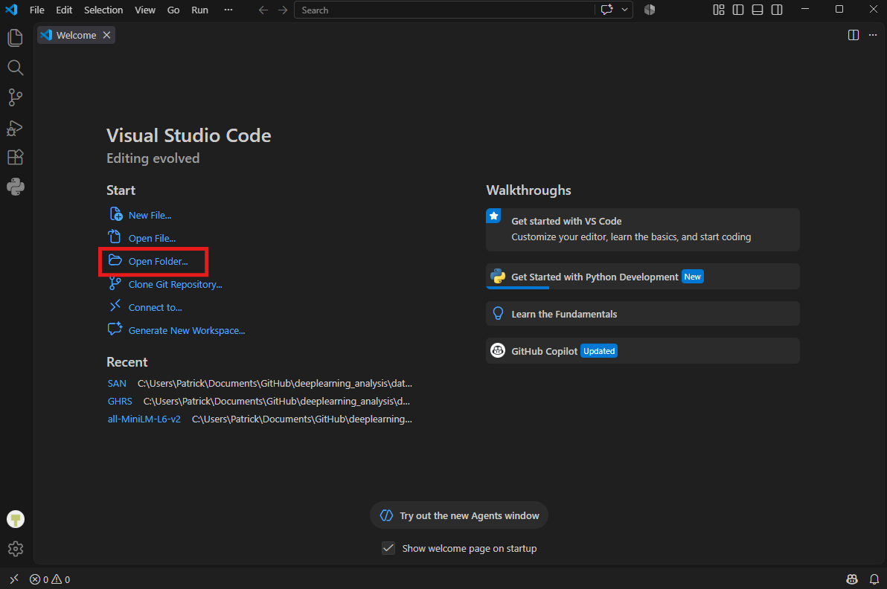
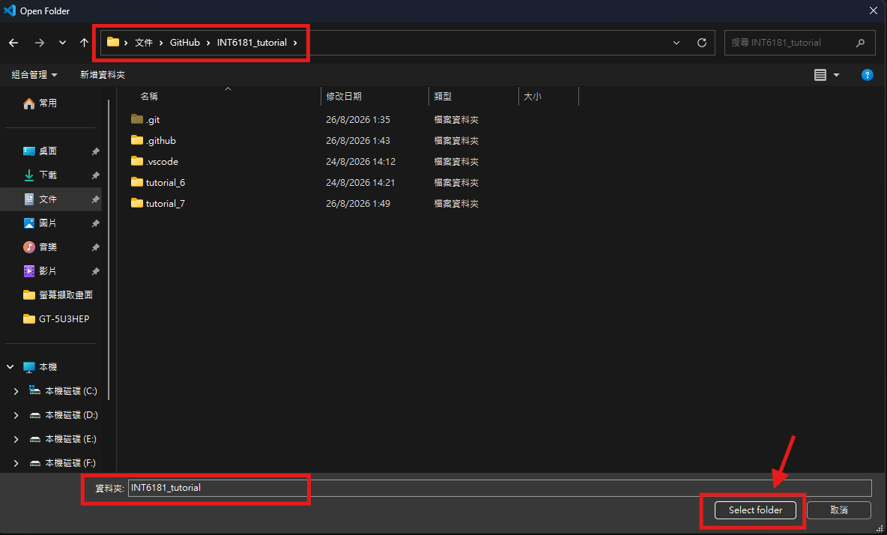
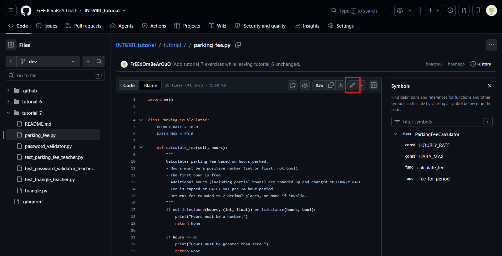
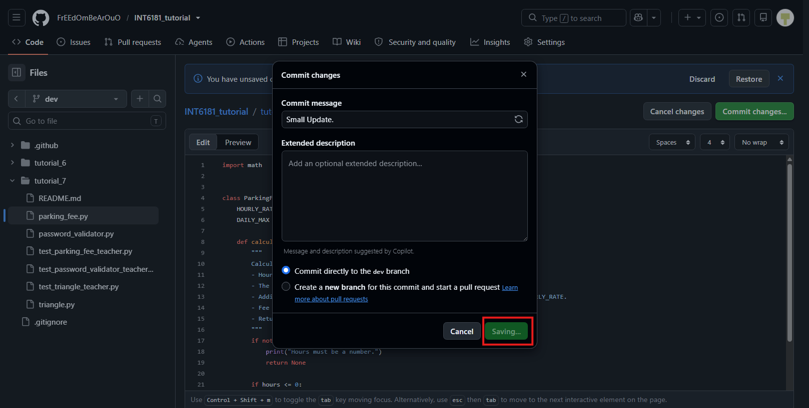

# INT6181 Tutorial 7

Tutorial 7: Automate Tests with GitHub Actions

In this tutorial you will set up a GitHub Actions workflow so the provided teacher tests run automatically on every pull request.

The modules under `tutorial_7` (`password_validator.py`, `triangle.py`, `parking_fee.py`) and all `test_*` test files are already provided in this repository on GitHub. Your job is to configure CI so those tests run in the GitHub cloud.

---

## Task: Set Up GitHub Actions

Set up GitHub Actions so the provided tests run automatically on pull requests.

1. Open your repository in VS Code. Create the workflow at the **repository root** (the folder that contains both `tutorial_6` and `tutorial_7`). 

   

   

2. Create a hidden folder named `.github`. Inside it, create another folder named `workflows`. Your workflow files must live under `.github/workflows/`.
3. In `workflows`, create a new YAML file.

   

4. Configure the YAML file.
5. Commit and push the workflow YAML (under `.github/workflows/`) to GitHub on your own branch.
6. Save the workflow file. Then make a small change under `tutorial_7` (for example, edit a print statement in one of the modules) so you have something to put on a pull request. Commit and push everything to GitHub on your own branch.

   

   

   

7. On GitHub, open a **pull request** from your branch into the target branch (for example `dev` or `main`).

   

   

When this task is done correctly, every future pull request should automatically re-run the tests.

---

## Expected Results

You should see a successful **Run Test** workflow run on the pull request (green check), with all tests passing:

