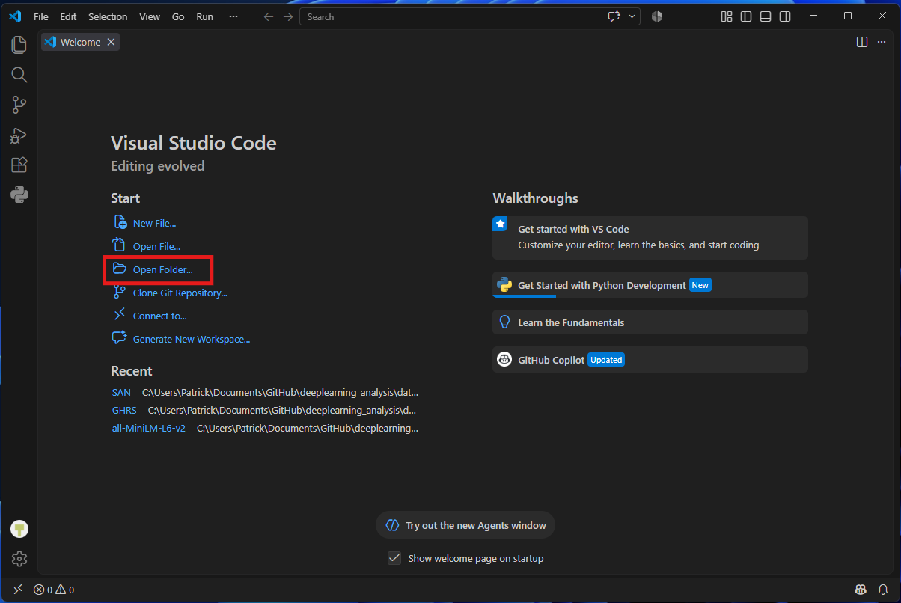
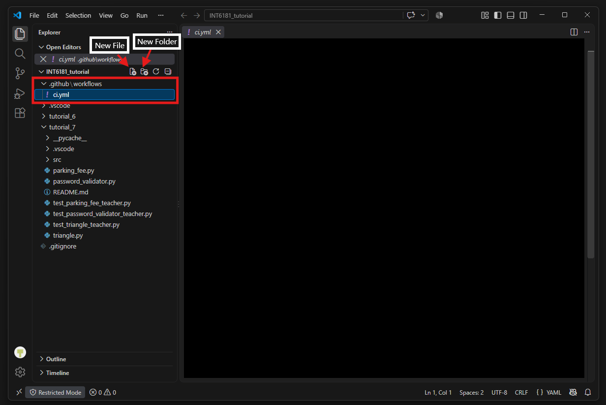
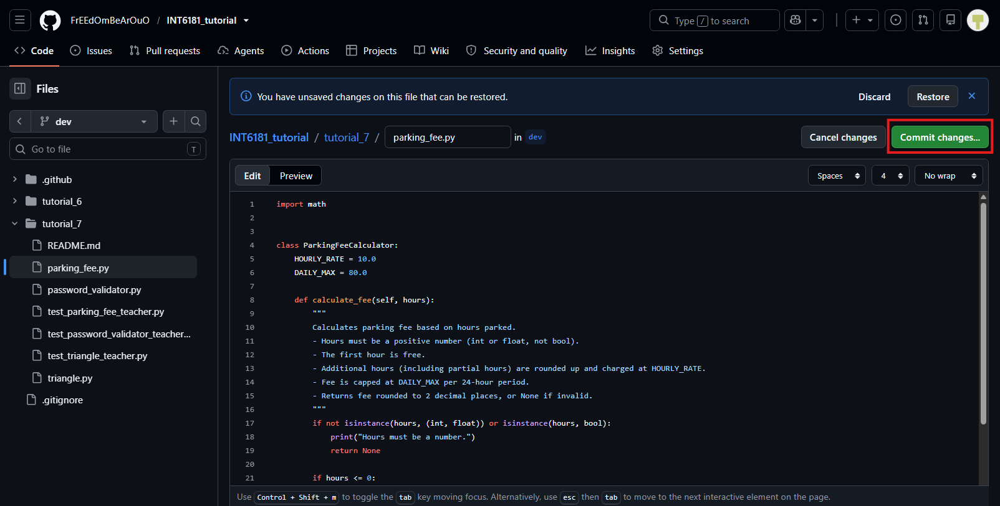
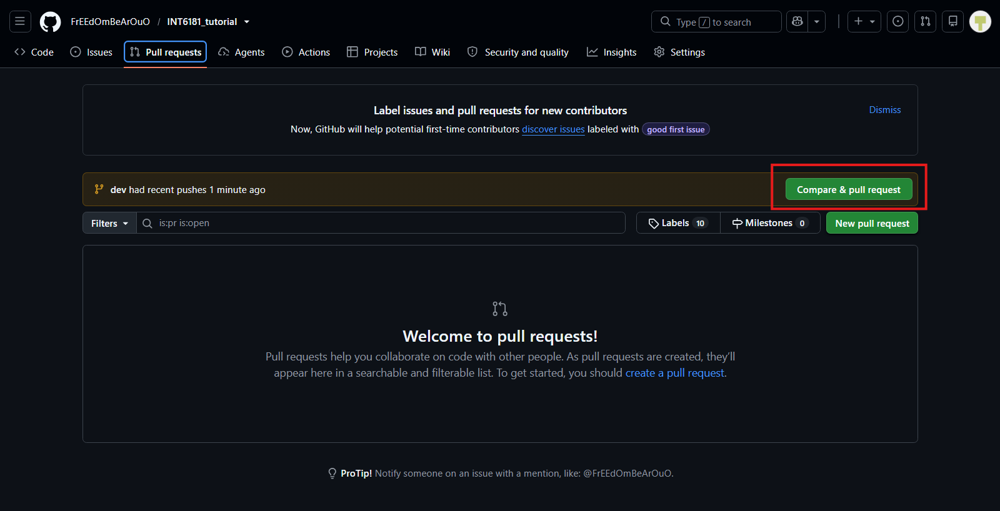
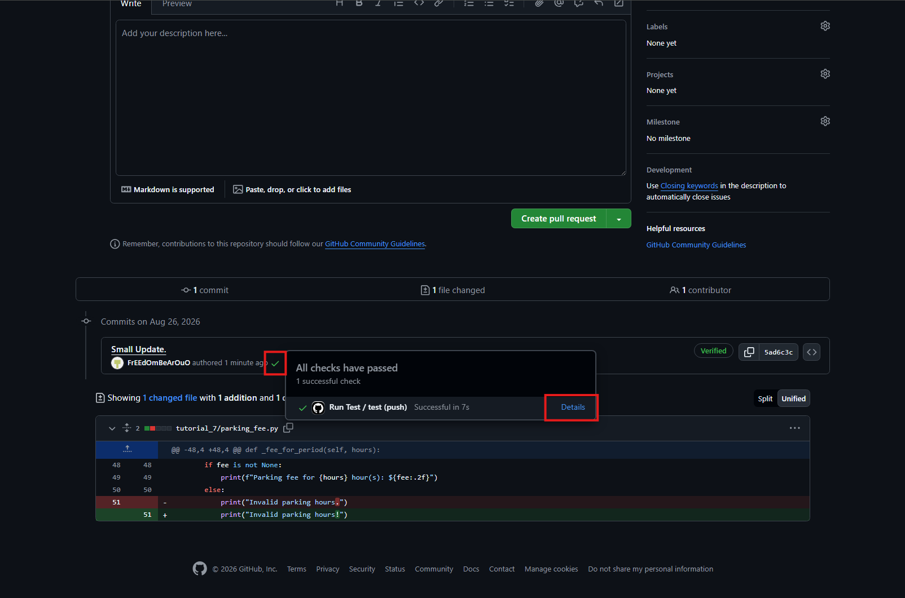

# INT6181 Tutorial 7

Tutorial 7: Continuous Integration with GitHub Actions

In this tutorial you will set up a GitHub Actions workflow so the provided teacher tests run automatically on every pull request.

The modules under `tutorial_7` (`password_validator.py`, `triangle.py`, `parking_fee.py`) and all `test_*` teacher test files are already provided in this repository on GitHub. You do not need to write the tests yourself. Your job is to configure CI so those tests run in the cloud.

---

## Task: Set Up GitHub Actions

Set up GitHub Actions so the provided tests run automatically on pull requests.

1. Open your repository in VS Code. Create the workflow at the **repository root** (the folder that contains both `tutorial_6` and `tutorial_7`). Do **not** put `.github` inside `tutorial_7`?GitHub only loads workflows from `.github/workflows/` at the root. The tests themselves will still **run inside** `tutorial_7` (see step 6).

   

   

2. Create a hidden folder named `.github`. Inside it, create another folder named `workflows`. Your workflow files must live under `.github/workflows/`.
3. In `workflows`, create a new YAML file.

   

4. Apply the workflow taught in the lecture.
5. Commit and push the workflow YAML (under `.github/workflows/`) to GitHub on your own branch.
6. Save the workflow file. Then make a small change under `tutorial_7` (for example edit a comment in one of the modules, or touch the README) so you have something to put on a pull request. Commit and push everything to GitHub on your own branch.

   

   

7. On GitHub, open a **pull request** from your branch into the target branch (for example `dev` or `main`).

   

   

When this task is done correctly, every future pull request should automatically re-run the teacher tests.

---

## Expected Results

You should see a successful **Run Test** workflow run on the pull request (green check), with all teacher tests passing:

