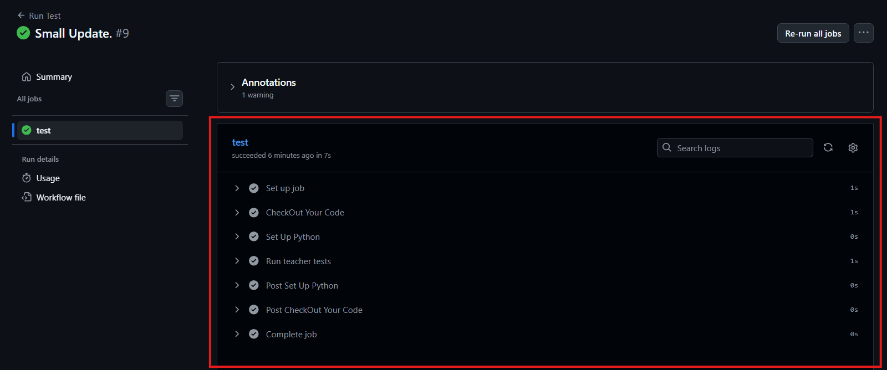

# INT6181 Tutorial 7

Tutorial 7: Automate Tests with GitHub Actions

In this tutorial you will set up a GitHub Actions workflow so the provided tests run automatically on every pull request.

The modules under `tutorial_7` (`password_validator.py`, `triangle.py`, `parking_fee.py`) and all `test_*` test files are already provided in this repository on GitHub.

---

## Task: Set Up GitHub Actions

Create a GitHub Actions workflow that runs the provided teacher tests on pull requests.

Inject some bugs to the implementations of the source files and open a pull request to observe what happens.

---

## Expected Results

